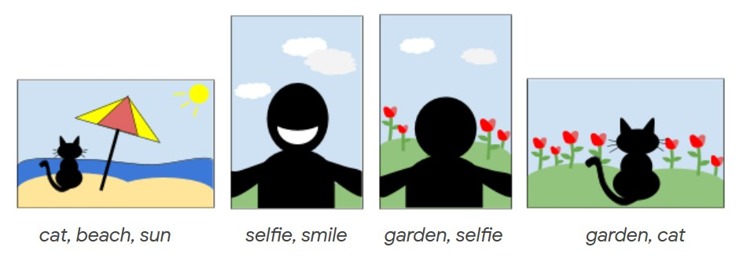

# Photo-slideshow-optimization
Google hashcode 2019 solution - A picture is worth a thousand words

<a href='https://storage.googleapis.com/coding-competitions.appspot.com/HC/2019/hashcode2019_qualification_task.pdf'>[Task]</a>
<a href='https://www.kaggle.com/c/hashcode-photo-slideshow'>[Kaggle's version]</a>

## Task 

Given a list of photos and the tags associated with each photo, arrange the photos into a slideshow that is as "interesting" as possible. This is an optimization problem.




## Structure

Plain code is stored on ```algos``` directory. Experiments are in the ```notebooks``` folder.

```
project
│
└───algos
│---│---greedy.py
│---│---nrpas.py
│---│---nested.py
│---│---uct.py
│---│---nmcsTimed.py  # Earlystop with time
│---│---nrpaTimed.py  # Earlystop with time
│   
└───notebooks
│---│---greedy.ipynb
│---│---nrpa.ipynb  # NRPA & SNRPA
│---│---uct.ipynb
│---│---nested.ipynb

```
